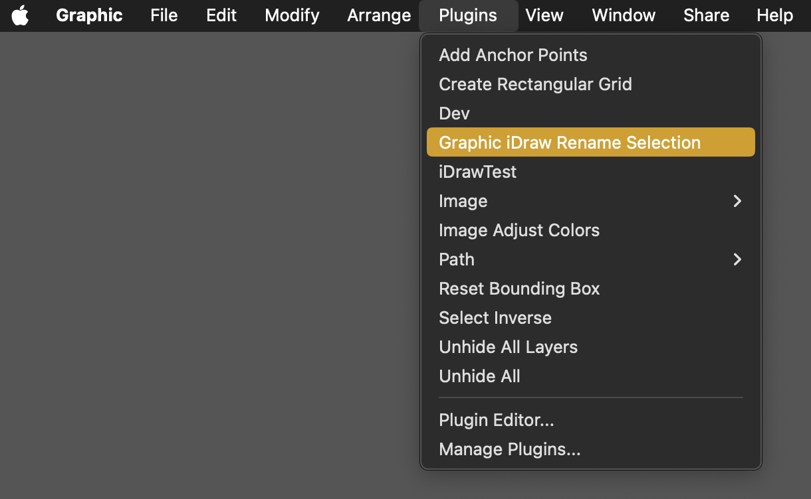
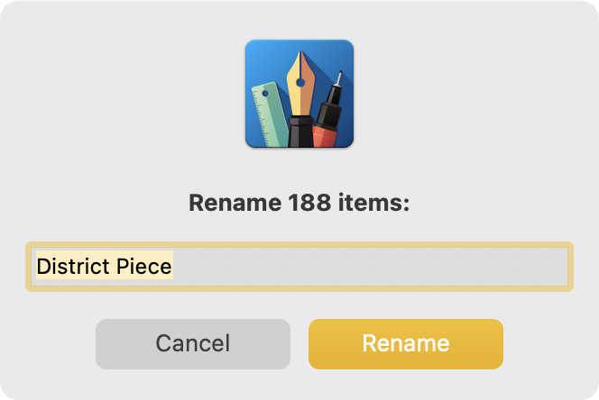
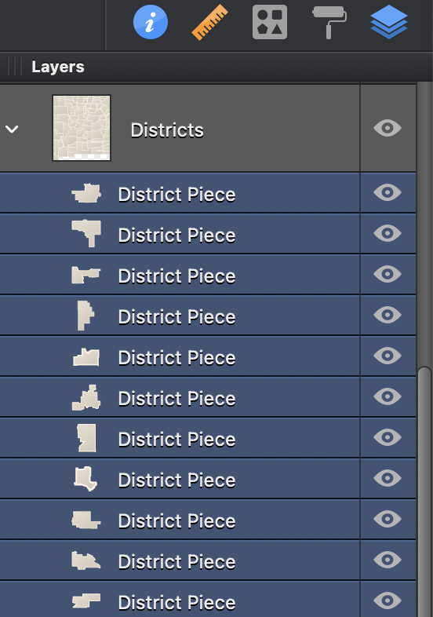
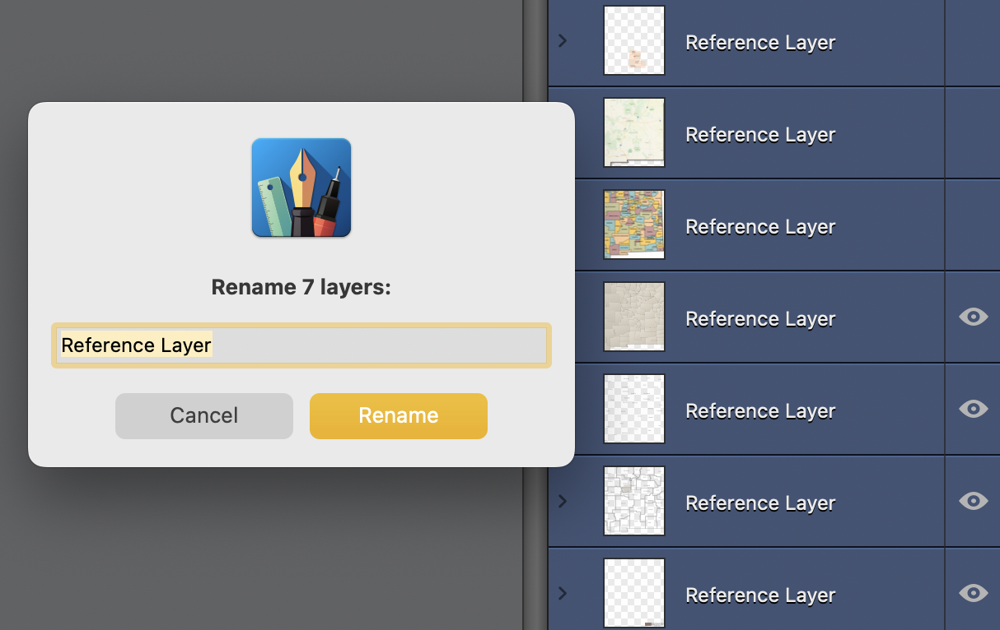
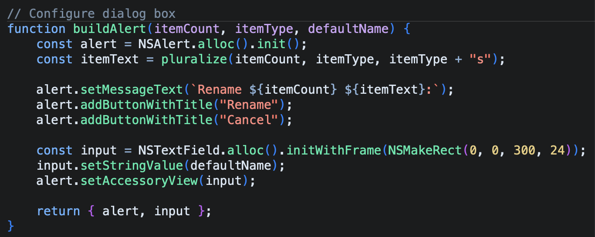

# Picta Graphic Rename Plugin

## Contents

- [About](#about)
- [Installation](#installation)
- [Usage](#usage)

## About

This plugin for [Picta Graphic](https://graphic.com/) (formerly known as Autodesk Graphic or Indeeo iDraw) can rename multiple objects simultaneously.

Once installed, select an item, choose **Graphic > Plugins > Graphic iDraw Rename Selection**, and assign a new name. Note that selected element will get the same name. Select **Edit > Undo Name** to revert the action.

Drawing applications like Picta Graphic often create documents with hundreds of objects and layers. To keep elements organized, you may need to assign recognizable names for each. By default, you can rename one item at a time. This plugin can rename all of them at once.

- Author: Jay Petronis
- Website:
- [https://github.com/Cyzor/picta-graphic-rename]
- [https://arcplanning.com/]

## Features

- Rename multiple items quickly
- Works with objects, groups, and layers

## System Requirements

- Picta Graphic version 3.1 or later
- macOS Mojave (version 10.14) or later

## Installation

To install, double-click the file **`Graphic iDraw Rename Selection.idplugin`** to launch Graphic, which should then ask if you'd like to add the plugin to your Plugins menu.

### Plugin File:

### Add Plugin:

Or you can manually drag the file to its destination in Graphic's `Application Support` folder in your `Library` folder:

`~/Library/Containers/com.indeeo.idraw/Data/Library/Application Support/iDraw/Plug-ins/Graphic iDraw Rename Selection.idplugin`

## Usage

Open a document in Graphic, select one or more objects, groups, or layers, then choose **Plugins > Graphic iDraw Rename Selection**.

Then type in a new name and confirm the entry.

The new name will apply to every selected element, and the change should be nearly instantaneous.

The plugin works for groups and layers, too.

Select **Edit > Undo Name** to revert the change.

## Details

Feel free to change the plugin's filename at any time, but keep the "`idplugin`" extension intact. Alternative names include:

- Graphic Renamer.idplugin
- GrafikUmbenennen.idplugin
- iDraw Renombrar Lote.idplugin
- この選択範囲の名前を変更する.idplugin

You can assign a custom keyboard shortcut to the plugin using **System Settings > Keyboard > Keyboard Shortcuts**, or with a third-party utility like Keyboard Maestro by Stairways Software:

https://www.keyboardmaestro.com/

The Graphic `idplugin` format is a JavaScript/CocoaScript file saved as plain text. Open it using any text editor to see how it works or make changes.

## Troubleshooting

If the plugin fails to load, ensure you have Picta Graphic version 3.1 or later installed.
macOS security settings may block the plugin. Check under **System Settings > Security & Privacy** if a prompt appears.

### Known Issues

- This plugin relies on Apple's [Cocoa APIs](<https://en.wikipedia.org/wiki/Cocoa_(API)>) and is not compatible with other platforms, such as Microsoft Windows. Additionally, it is only available in English and may exhibit anomalies when used with other language settings.
- As Graphic hasn't received updates since 2018, it might become incompatible with future macOS versions.
- The input field accepts text of any length and format. However, inputting an excessively large block of text, such as a novel-length string of emojis, may lead to performance degradation or an application crash.
- Graphic's plugin mechanism might not recognize symbolic links or aliases. But [hard links](https://en.wikipedia.org/wiki/Hard_link) seem to be valid.

## Version History

### 0.1.0 - 2024-09-20

- Added instructions and usage notes

### 0.0.0 - 2024-08-29

- Initial release

## License

This work is dedicated to the public domain under the CC0 1.0 Universal (CC0 1.0) Public Domain Dedication.

## Support

For further information about Graphic plugins, visit:

- https://www.graphic.com/
- https://graphic.com/plugins/api
- https://www.graphic.com/docs/scripts
- https://github.com/ccgus/CocoaScript

Developed for Graphic 3.1 for macOS Sonoma 14.0.

### Last Updated

2024-09-19
